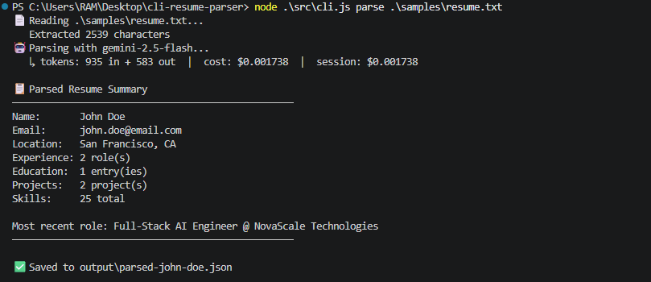
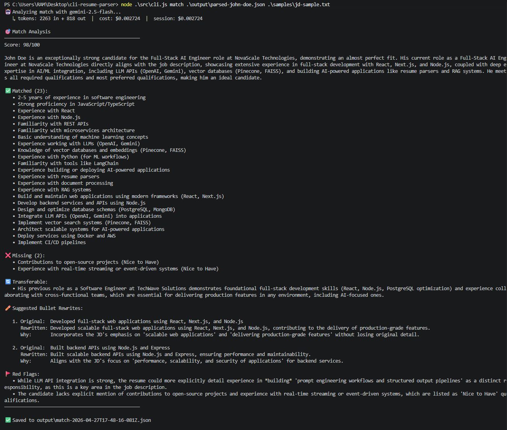
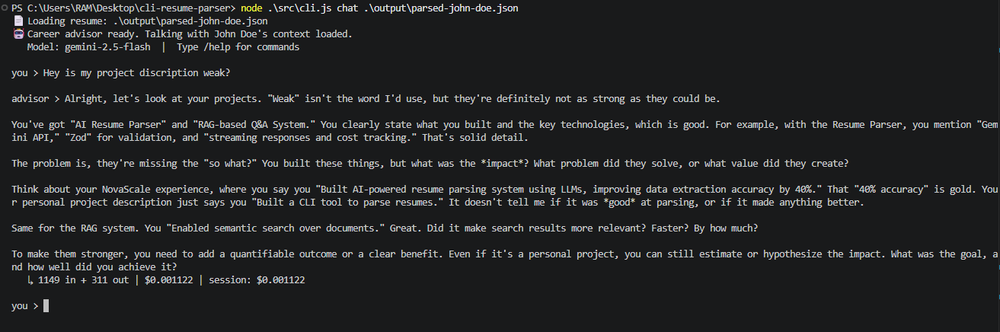

# AI Resume Parser CLI

> A command-line tool that parses resumes into structured JSON, matches them against job descriptions, and lets you chat with your resume as a career advisor — all powered by Google Gemini.

[Insert a terminal screenshot or asciinema GIF here]

## Why I built this

I'm transitioning from MERN full-stack development into AI Application Engineer roles. Rather than passively learning LLM APIs through tutorials, I scoped a real tool I'd actually use during my own job search. This project covers the foundational AI engineering concepts: schema-constrained structured output, multi-turn conversation with sliding-window history, streaming responses, retry logic with exponential backoff, and per-call cost tracking.

The tool has already given me feedback I'd otherwise have paid a recruiter for. That's the bar I held it to.

## Features

- **`parse`** — Extracts structured data (contact, skills, experience, education, projects, publications) from `.txt` or `.pdf` resumes using Zod-validated schema-constrained output.
- **`match`** — Analyzes a parsed resume against a job description; returns match score, matched/missing skills, transferable experience, bullet rewrites, and red flags.
- **`chat`** — Interactive career advisor that streams responses, maintains sliding-window history, and references your actual resume in every reply.
- **Cost tracking** — Every API call logs input/output tokens and dollar cost; running session total displayed.
- **Retry with backoff** — `p-retry` handles 429s and 5xx errors; non-retryable errors (400, 401) surface immediately.
- **Model swapping** — `--model` flag on every command (`gemini-2.5-flash-lite`, `gemini-2.5-flash`, `gemini-2.5-pro`).

## Tech Stack

- **Runtime:** Node.js (ESM)
- **LLM:** Google Gemini 2.5 (Flash for parse/chat, Pro for match)
- **SDK:** `@google/genai`
- **Validation:** Zod
- **CLI:** Commander
- **PDF:** pdf-parse-fork
- **Reliability:** p-retry

## Architecture

\`\`\`
┌──────────────┐
│   cli.js     │  Commander entry point, flag parsing
└──────┬───────┘
       │
       ▼
┌──────────────────────────────────┐
│  commands/{parse,match,chat}.js  │  Command orchestration, file I/O
└──────┬───────────────────────────┘
       │
       ▼
┌──────────────┐     ┌────────────────┐
│  lib/        │────▶│  Gemini API    │
│  ├ gemini    │     └────────────────┘
│  ├ schemas   │     
│  ├ prompts   │     ┌────────────────┐
│  ├ pricing   │────▶│  Cost tracker  │
│  └ cost...   │     └────────────────┘
└──────────────┘
\`\`\`

Key design decisions:
- **JSON schema for Gemini, Zod for validation.** Gemini rejects schemas with `$ref`, so the request schema is hand-written. Zod validates the response separately at runtime — a defense-in-depth boundary.
- **Single retry chokepoint.** All API calls go through `withRetry` in `lib/gemini.js`, so retry policy is centralized. Adding a new endpoint can never accidentally bypass retries.
- **System instruction holds the resume.** In chat mode, the resume sits in `systemInstruction` (not history), so it persists across turns at no incremental cost and survives sliding-window truncation.

## Setup

\`\`\`bash
git clone https://github.com/<your-username>/cli-resume-parser.git
cd cli-resume-parser
npm install
cp .env.example .env
# Add your GOOGLE_API_KEY to .env (free tier works — get one at https://ai.google.dev)
\`\`\`

## Usage

\`\`\`bash
# Parse a resume
node src/cli.js parse samples/sample-resume.txt

# Match against a job description
node src/cli.js match output/parsed-<name>.json samples/jd-sample.txt

# Chat with your resume
node src/cli.js chat output/parsed-<name>.json

# Use a different model
node src/cli.js parse samples/sample-resume.txt --model gemini-2.5-pro
\`\`\`

In chat mode, type `/help` to see commands (`/tokens`, `/history`, `/reset`, `/exit`).

## Example output

[Paste a real (sanitized) parse output here — 20-30 lines of the JSON. Pick the cleanest one.]

## Cost analysis

Real numbers from my testing on Gemini Flash:

| Operation | Avg input tokens | Avg output tokens | Cost |
|-----------|------------------|-------------------|------|
| Parse (1 resume) | ~1,200 | ~900 | $0.0028 |
| Match (1 JD)     | ~3,500 | ~1,500 | $0.0048 (Flash) / $0.0194 (Pro) |
| Chat (per turn)  | grows with history | ~200-400 | $0.0001-$0.0010 |

Parsing 1,000 resumes on Flash: **~$2.80**.
Matching 1,000 candidates against 1 JD on Pro: **~$19.40**.

The model selection per command is deliberate: parse and chat run on Flash because instruction-following matters less; match runs on Pro because honest, specific bullet rewrites required stronger reasoning. This trade-off is documented and overridable via `--model`.

## What I learned

- **Schema is prompt.** Field descriptions and `required` markers shape model output as much as the user prompt. A vague `description: "the candidate's name"` produces sloppier extraction than `description: "Full name as written on the resume; do not abbreviate"`.
- **Stronger model > better prompt, eventually.** I spent 30 minutes tightening the match prompt to stop the model from filler-phrase rewrites. Switching to Gemini 2.5 Pro fixed it in one config change.
- **Cost is dominated by output tokens, not input.** Output is ~8x the per-token price of input on Flash. This shaped how I wrote prompts (concise, no preamble) and which fields are required vs. optional.
- **History grows the per-call cost in chat.** Without sliding window, turn 50 sends ~5,000 tokens of history every time. Watching the cost tracker climb across turns made this visceral in a way reading about it didn't.
- **PDF extraction is lossy.** `pdf-parse` choked on the original ESM dynamic import; `pdf-parse-fork` worked. Multi-column resumes still produce garbled text. Real production tools use `pdfjs-dist` or commercial OCR.

## What I'd do differently

- Add semantic caching with embeddings — currently a re-run of the same resume re-pays full cost.
- Persist chat history to MongoDB so sessions survive across runs.
- Build a web frontend (Express + React) with SSE streaming to the browser.
- Replace JSON schema duplication with `zod-to-json-schema` and a custom transformer that strips `$ref` for Gemini compatibility.
- Add a `--batch` mode for parsing/matching against a folder of resumes.

## 📸 Demo

### Parse

### Match

### Chat

## License

MIT